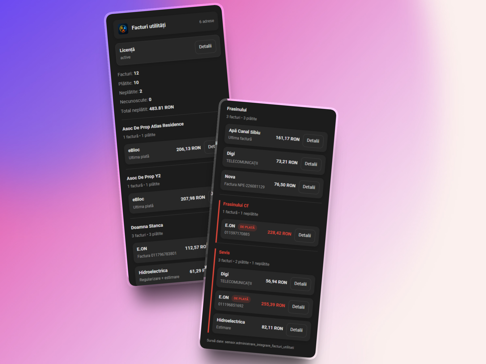
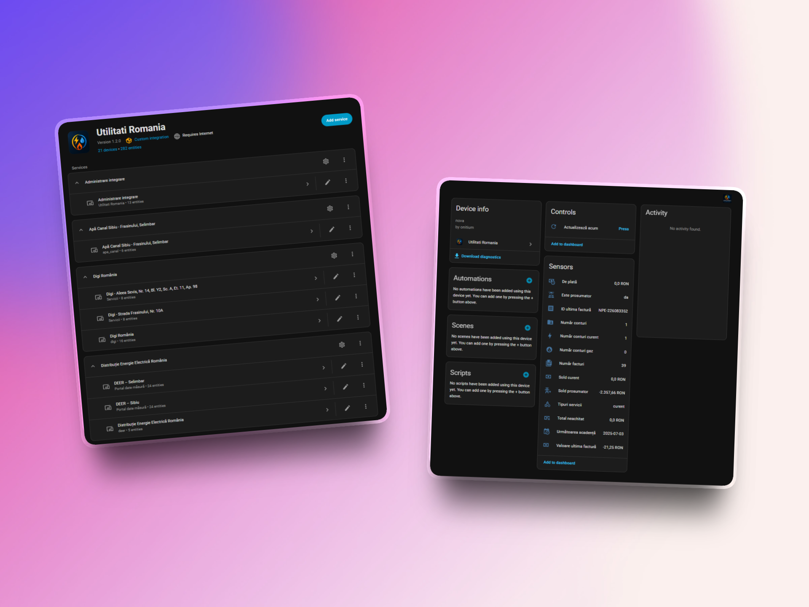

# Utilități România – Home Assistant Integration

Integrare unificată pentru gestionarea utilităților din România direct în Home Assistant.

Centralizează facturi, notificări și transmiterea indexului într-un singur loc, indiferent de furnizor.

---

## ✨ Funcționalități principale

- 📄 Facturi centralizate pentru mai mulți furnizori
- 🏠 Suport multi-locație (mai multe adrese / POD-uri / contracte)
- 🔔 Notificări automate:
  - facturi noi emise
  - deschiderea perioadei de citire a indexului
- ✍️ Transmitere index direct din dashboard
- 🧠 Detectare automată perioadă de citire
- 🔑 Sistem de licențiere integrat (trial 90 zile + lifetime)
- 🧩 Integrare nativă Home Assistant

---

## 🖼️ Interfață

### Card facturi utilități

---

### Integrarea în Home Assistant

---

### Device & Control

---

## ⚡ Furnizori suportați (în prezent)

- E.ON
- Hidroelectrica
- myElectrica
- Digi
- Nova
- Apă Canal Sibiu
- eBloc

👉 Lista este în continuă extindere. Vor fi adăugați și alți furnizori.

---

## 🚀 Instalare

### Prin HACS

1. Deschide HACS
2. Mergi la Integrations
3. Adaugă repository custom:
   https://github.com/mariusonitiu/utilitati_romania
4. Instalează integrarea
5. Restart Home Assistant

---

## ⚙️ Configurare

1. Settings → Devices & Services
2. Add Integration
3. Caută Utilități România

---

## 📊 Card custom

type: custom:utilitati-romania-facturi-card

---

## 🔑 Licență

- Trial 90 zile inclus
- Upgrade la lifetime

---

## ☕ Susține proiectul

https://buymeacoffee.com/mariusonitiu

---

## 📌 Roadmap

- noi furnizori
- îmbunătățiri UI
- optimizări

---

## ⚠️ Disclaimer

Integrare neoficială.
