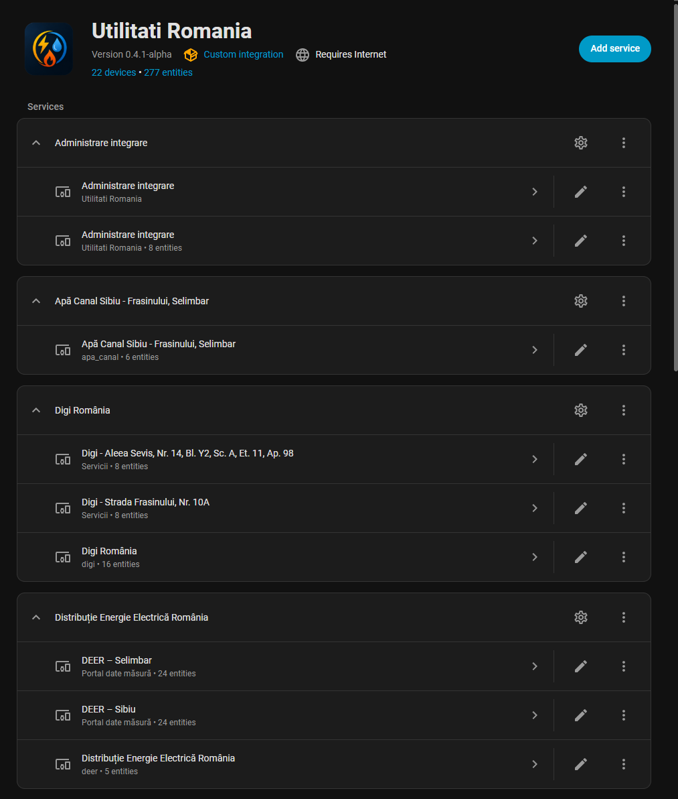
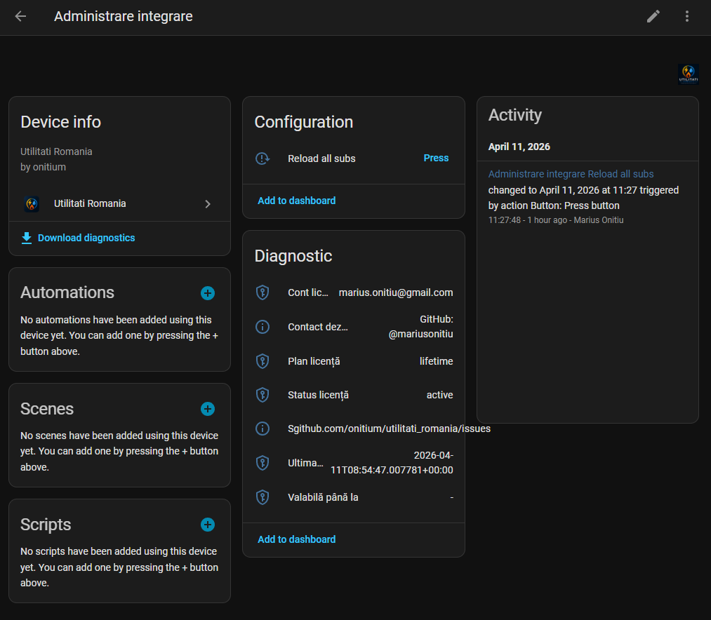
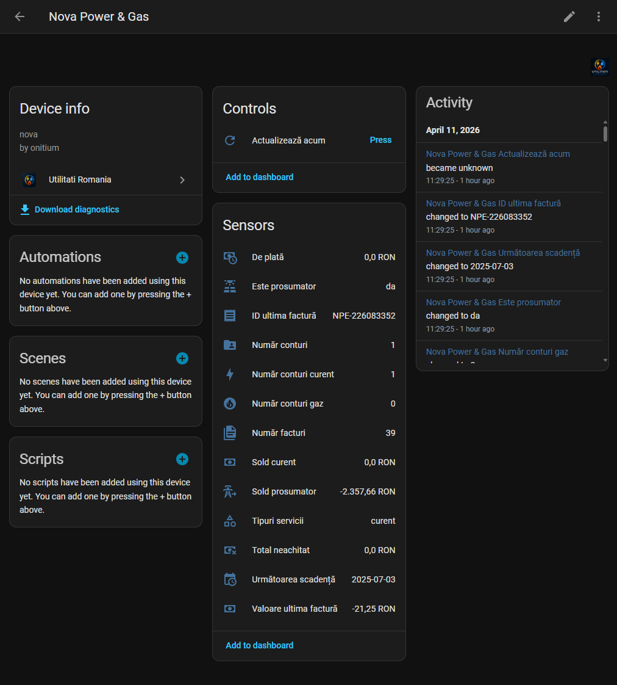
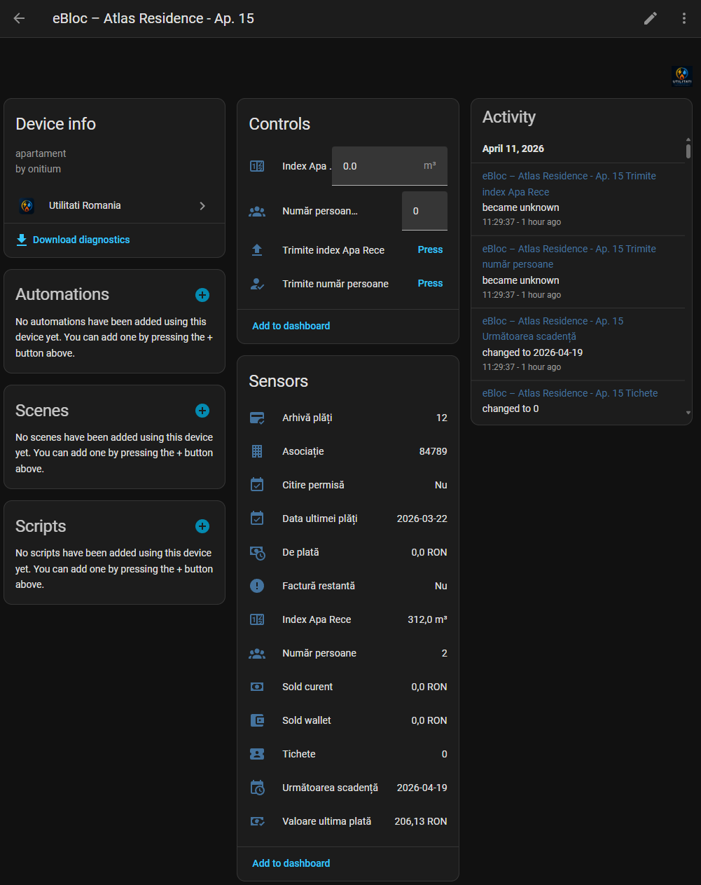

# 🇷🇴 Utilități România – Home Assistant Integration

Integrarea **Utilități România** aduce într-un singur loc datele de consum, facturare și interacțiune cu furnizorii de utilități din România, direct în Home Assistant.

Am construit integrarea asta dintr-o nevoie reală: să nu mai intru în mai multe aplicații pentru fiecare furnizor și să pot face lucruri simple, cum ar fi trimiterea indexului, direct din Home Assistant.

---

## 📸 Preview

### Overview

### Administrare integrare

### Exemplu furnizor

### eBloc (exemplu avansat)

---

## 🔥 Ce oferă integrarea

- Integrare unificată pentru mai mulți furnizori
- Suport pentru mai multe locații / contracte
- Senzori pentru:
  - consum
  - facturi
  - plăți
  - scadențe
  - solduri
- Trimitere index direct din Home Assistant
- Gestionare număr persoane (unde este permis)
- Panou central de administrare
- Reload global pentru toate sub-integrările
- Diagnostics integrat pentru debugging

---

## 🏢 Furnizori suportați

- Hidroelectrica  
- E.ON România  
- myElectrica  
- Apă Canal Sibiu  
- eBloc  
- Digi România  
- Nova Power & Gas  

> ⚠️ Nu toate funcțiile sunt disponibile pentru fiecare furnizor.

---

## 📦 Instalare

### Varianta recomandată (HACS)

1. Deschide HACS  
2. Mergi la Integrations  
3. Meniu (⋮) → Custom repositories  
4. Adaugă:  
   `https://github.com/mariusonitiu/utilitati_romania`  
5. Tip: Integration  
6. Instalează  
7. Restart Home Assistant  

---

### Instalare manuală

Copiază folderul:

`custom_components/utilitati_romania`

și dă restart Home Assistant.

---

## ⚙️ Configurare

1. Settings → Devices & Services  
2. Add Integration  
3. Caută „Utilități România”  
4. Alege furnizorul  
5. Introdu datele de login + cheia de licență  

---

## 🔐 Licență

- 90 zile trial (complet funcțional)
- licență lifetime

După expirare:
- integrarea rămâne activă
- dar nu mai actualizează datele și nu mai execută acțiuni

---

## 🧩 Administrare

Se creează un device separat: **Administrare integrare**

Acolo ai:
- Reload all sub-integrations
- Status licență
- Valabilitate
- Plan
- Cont licență
- Informații suport

---

## 🔁 Reload global

Din UI sau:

`service: utilitati_romania.reload_all`

---

## ⚠️ Limitări

- unele conturi nu permit trimiterea indexului
- unele locații nu permit modificări
- API-urile furnizorilor pot suferi modificări

---

## 🛠 Troubleshooting

**Nu apar entități**
- restart complet Home Assistant
- verifică logs

**Entități unavailable**
- verifică licența
- verifică autentificarea

---

## 🧾 Diagnostics

Integrarea oferă export complet pentru debugging (fără date sensibile).

---

## 👨‍💻 Autor

Marius Onițiu  
https://github.com/mariusonitiu  

---

## ❤️ Suport

Dacă îți este utilă integrarea:

⭐ lasă un star pe GitHub  
☕ Buy me a coffee  

---

## ⚖️ Disclaimer

Integrarea nu este afiliată oficial cu furnizorii și folosește API-uri publice sau reverse engineered.
